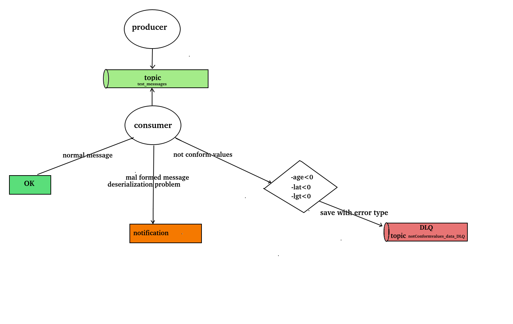
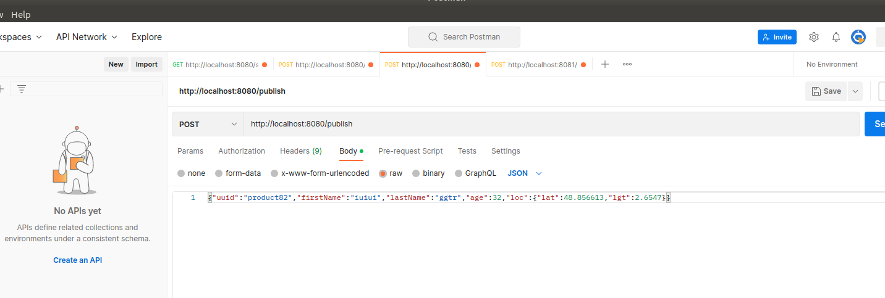
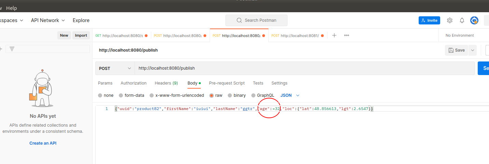

# Handling Kafka Errors

## discription :
the project consists in managing the errors of kafka in consumption,  given a message in Person format (read the format in code) in a kafka topic:
- if the message contains an incorrectly entered value: serialization problem (example: expected integer-> character entered), the consumer ignore the message and sends a notification,
- if the message contains a non-compliant value: negative age for example, the message will be ignored and sent to another topic for a future revision
 
 

## needed tools:
1. Docker (and docker-compose)
2. Java
3. Kafka
## how to use :
### 1. build services locally:
1. build services:zookeeper kafka brocker : _docker-compose up -d_
3. starts services(run main classes: _HandlingKafkaErrorsApplication)
 
### 2. send data:
1. send normal message or message with not conform values-> use integrated producer  
  

 
2. send mal formed message (deserialization problem) -> use kafka-console-producer:
   -  kafka-console-producer --broker-list localhost:9092 --topic test_messsages --property "parse.key=true" --property "key.separator=:"
   -  deserializ_prob:{"uuid":"deserializ_prob","firstName":"iuiui","lastName":"ggtr","age":badage32,"loc":{"lat":48.856613,"lgt":2.6547}}

   in postmen: copy past, post method, url: http://localhost:8080/publish, send.
 

## Examples of messages types:

* good message: 
{"uuid":"farim","firstName":"farid","lastName":"imakh","age":35,"loc":{"lat":48.856613,"lgt":2.6547}}

* bad messages(must saved on another topic named bad_messsages_toDLQ): 
.  {"uuid":"bad_age","firstName":"iuiui","lastName":"ggtr","age":-32,"loc":{"lat":48.856613,"lgt":2.6547}} 
.  {"uuid":"bad_lat","firstName":"iuiui","lastName":"ggtr","age":32,"loc":{"lat":-48.856613,"lgt":2.6547}} 
.  {"uuid":"bad_lgt","firstName":"iuiui","lastName":"ggtr","age":32,"loc":{"lat":48.856613,"lgt":-2.6547}} 

* mal formed message (deserialization problem)->use kafka-console-producer to push data: 
. bad_age:{"uuid":"bad_lgt","firstName":"iuiui","lastName":"ggtr","age":xyzt32,"loc":{"lat":48.856613,"lgt":2.6547}} 
. bad_lat:{"uuid":"bad_lat","firstName":"iuiui","lastName":"ggtr","age":32,"loc":{"lat":xyz48.856613,"lgt":2.6547}} 
. bad_lat:{"uuid":"bad_lat","firstName":"iuiui","lastName":"ggtr","age":32,"loc":{"lat":48.856613,"lgt":xyz2.6547}} 
